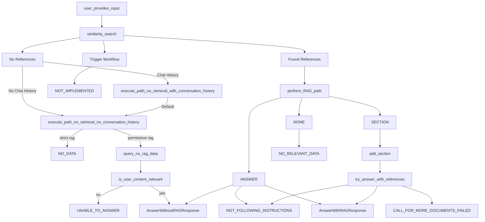

# A Base Project for Retrieval Augmented Generation (RAG) for Regulations

The public nature of regulatory text and associated documents means that Large Language Models should already be aware of them. This project, however, seeks to minimize an LLM's reliance on its internal model weights as a source of facts by providing relevant extracts for the model to use when responding to a user. This reduces model hallucination. Providing the user with the same extracts ensures they have the ability to critically examine the model's response. This minimizes the chance of regulatory non-compliance. 

A feature of regulatory text is that *every section* can be identified through a reference (e.g., B.5(B)(iii)(a)(bb)). This project makes integral use of this feature via the Document class `.get_text(section_reference)` method. The text returned from this method needs to be *complete*. Consider the following illustration:
```
incomplete_text = poorly_constructed_document.get_text('B.5(B)(iii)(a)(bb)')
print(incomplete_text)
(bb) documentary evidence is presented, verifying the amounts due and that the commitment was entered into before the applicants took up residence in South Africa.  

complete_text = well_constructed_document.get_text('B.5(B)(iii)(a)(bb)')
print(complete_text)
B.5 Personal transfers by foreign nationals and immigrants  
    (B) Immigrants  
        (iii) Payments by immigrants  
            (a) Applications by immigrants may be approved by Authorised Dealers for the provision of foreign currency to cover current and arrear premiums due on foreign currency life insurance policies or contributions to pension and medical aid funds, provided that:  
                (bb) documentary evidence is presented, verifying the amounts due and that the commitment was entered into before the applicants took up residence in South Africa.  
```

If you ask a model to answer a question and provide section B.5(B)(iii)(a)(bb) as a reference, you should not expect great results if you were working from `poorly_constructed_document`. 

Multiple documents make up a `corpus`. Typically the corpus consists of the regulation (one `Document`) and things like guidelines, legal findings or internals FAQs included as their own `documents`. 

For each document, the main task at hand is the creation of an *index* which is used for the 'R' in RAG - Retrieval. If you don't have really, really good retrieval, your RAG model will suck. I write about how to create an index [here](https://www.aleph-one.co/rag/turning-a-document-into-data/). You should read that. Really. Without rehashing that blog, let's just agree that: "What information is required if an immigrant needs foreign currency for a life policy?" is a question which is answered in B.5(B)(iii)(a)(bb). The *index* consists of embeddings of questions like this along with their section reference B.5(B)(iii)(a)(bb). When the user asks a question, an embedding of the question is compared to all the embeddings in the index and the section references of 'close' embeddings are returned (`path_search.py`). With retrieval complete, we pass the question and references to an LLM (`path_rag.py`) and manage the pure joy that accompanies the unstructured text result.

Note 1: I have found through experience that having a dedicated index for definitions is incredibly helpful.  
Note 2: I have moved "paths" out of the main CorpusChat object into their own objects to keep the code manageable but also allow implementing classes to use polymorphism for fine-tuning prompts (system messages) and behaviours

Below is an outline of the workflow implemented in `corpus_chat.py`



