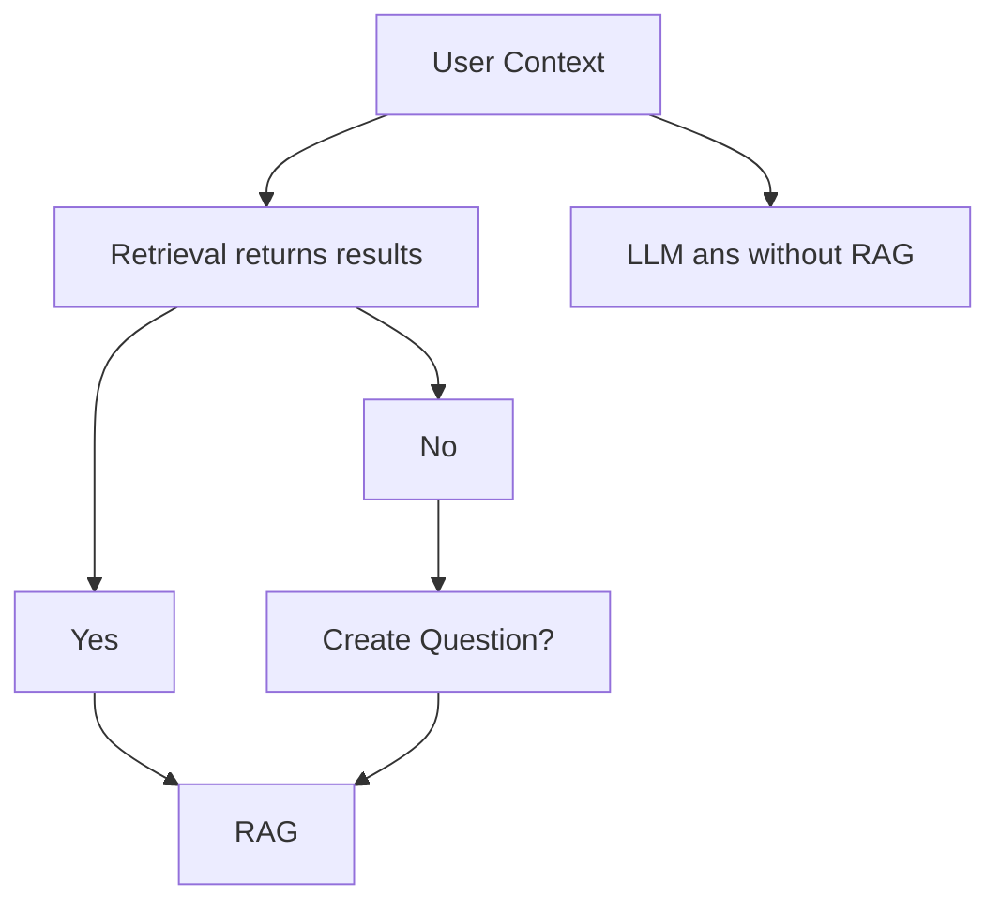
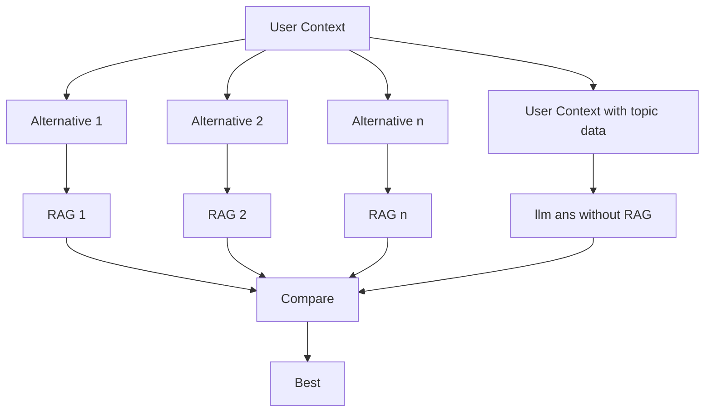

## Important Concepts and terminology
- section_reference: Something like A.1(B)(ii) which needs to have passed "reference_checker" validation
- section_text: The test of the regulation that corresponds to the section reference
- lookup_text: A summary of, a question about or the section_text itself. This is the thing that gets embedded which helps retrieve the correct section_text for the LLM

```mermaid
graph TD
    user_context[User Context] --> db_results[Retrieval returns results]
    db_results --> db_results_yes[Yes]
    db_results --> db_results_no[No]
    db_results_no --> create_question[Create Question?]
    db_results_yes --> rag[RAG]
    create_question --> rag
    user_context --> without_rag[LLM ans without RAG]
```

```mermaid
graph TD
    user_context[User Context] --> alt_1[Alternative 1]
    user_context --> alt_2[Alternative 2]
    user_context --> alt_n[Alternative n]
    user_context --> alt_n_plus_1[User Context with topic data]

    alt_1 --> rag_1[RAG 1]
    alt_2 --> rag_2[RAG 2]
    alt_n --> rag_n[RAG n]
    alt_n_plus_1 --> no_rag[llm ans without RAG]

    rag_1 --> compare[Compare]
    rag_2 --> compare[Compare]
    rag_n --> compare[Compare]
    no_rag --> compare[Compare]

    compare --> best[Best]

```